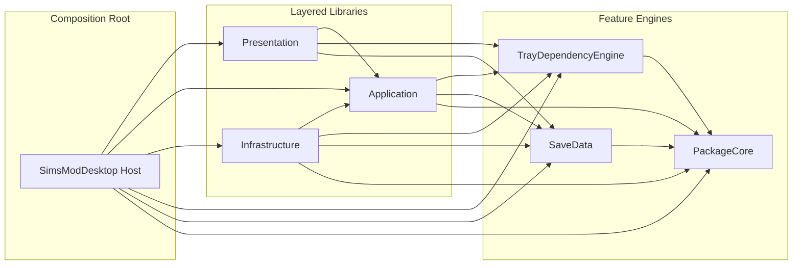

# SimsToolkit Technical Architecture

[](LICENSE)
[](https://dotnet.microsoft.com/)
[]()

[中文文档](README.zh-CN.md)

## 1. System Overview

SimsToolkit is a desktop toolkit for The Sims 4 mod/file workflows and game data inspection.

The current codebase is organized around a layered .NET architecture:

* `SimsModDesktop`: Avalonia host and shell composition
* `SimsModDesktop.Presentation`: view models, UI controllers, navigation, warmup orchestration
* `SimsModDesktop.Application`: use-case contracts, planners, validators, coordinators
* `SimsModDesktop.Infrastructure`: persistence, file/hash/config services, tray/save adapters
* `SimsModDesktop.PackageCore`: DBPF/package parsing primitives
* `SimsModDesktop.SaveData`: save readers and household export support
* `SimsModDesktop.TrayDependencyEngine`: tray dependency analysis/export

Compile-time boundary summary:

* `SimsModDesktop` is the only composition root that references `Presentation`, `Application`, and `Infrastructure` together.
* `SimsModDesktop.Presentation` references `Application` plus feature engines, but does not reference `Infrastructure`.
* `SimsModDesktop.Application` defines stable contracts and orchestration, but does not reference `Infrastructure`.
* `SimsModDesktop.Infrastructure` implements `Application` contracts and is wired by the host at runtime.

Detailed architecture notes live in:

* [`src/SimsModDesktop/docs/ArchitectureOverview.md`](src/SimsModDesktop/docs/ArchitectureOverview.md)
* [`src/SimsModDesktop/docs/EngineeringConventions.md`](src/SimsModDesktop/docs/EngineeringConventions.md)
* [`src/SimsModDesktop/docs/CacheWarmupSequence.md`](src/SimsModDesktop/docs/CacheWarmupSequence.md)

---

## 2. Core Capabilities

### 2.1 Toolkit Actions

* `Organize`
* `Flatten`
* `Normalize`
* `Merge`
* `FindDuplicates`

These flows are planned by `ToolkitActionPlanner` and dispatched through `ExecutionCoordinator`.

### 2.2 Mods / Tray / Save Workspaces

* Mods: indexed catalog, inspect flow, query caching, idle prewarm
* Tray: preview, metadata/thumbnail caches, dependency analysis/export
* Save: descriptor-first preview, on-demand household artifact generation, export support

### 2.3 Asset Processing

* DBPF package parsing and resource indexing
* texture decode/resize/encode/compression
* tray bundle analysis reuse and package-index-backed dependency analysis

---

## 3. Layered Composition



### 3.1 Runtime Entry Points

* `Program.cs` starts Avalonia
* `Composition/ServiceCollectionExtensions.cs` composes the container
* `MainShellViewModel` owns shell-level navigation and startup prewarm scheduling
* `MainWindowViewModel` and dedicated workspace VMs own page behavior

The host resolves concrete implementations through DI. There is no direct `Presentation -> Infrastructure` or `Application -> Infrastructure` assembly reference in the current solution.

### 3.2 Dependency Injection Registration

Registration is split into:

* `AddSimsModDesktopApplication()`
* `AddSimsModDesktopPresentation()`
* `AddSimsModDesktopInfrastructure()`
* desktop shell adapters in `src/SimsModDesktop/Composition/ServiceCollectionExtensions.cs`

---

## 4. Solution Layout

```text
/
├── src/SimsModDesktop/                        # Desktop host (Avalonia app shell)
├── src/SimsModDesktop.Application/            # App-layer contracts/planning/execution
├── src/SimsModDesktop.Presentation/           # ViewModels/controllers/navigation
├── src/SimsModDesktop.Infrastructure/         # Cross-platform services + persistence
├── src/SimsModDesktop.PackageCore/            # DBPF/package parsing core
├── src/SimsModDesktop.SaveData/               # Save/tray export readers and models
├── src/SimsModDesktop.TrayDependencyEngine/   # Tray dependency analysis + export
├── src/SimsModDesktop.Tests/                  # App/presentation/infrastructure tests
├── src/SimsModDesktop.PackageCore.Tests/      # PackageCore tests
└── src/SimsModDesktop.TrayDependencyEngine.Tests/ # Dependency engine tests
```

---

## 5. Engineering Notes

* Application layer remains UI-agnostic and infrastructure-agnostic.
* Presentation and Application stay free of direct `Infrastructure` references; the host composes implementations at runtime.
* Tray dependency cache stays separate from UI preview cache on purpose.
* `Mods`, `Tray`, and `Save` now share the same background prewarm foundation, while keeping domain-specific stores separate.
* `Save` preview is descriptor-first; dependency analysis uses on-demand artifacts.

Useful docs:

* [ArchitectureOverview.md](src/SimsModDesktop/docs/ArchitectureOverview.md)
* [ModularizationPlan.md](src/SimsModDesktop/docs/ModularizationPlan.md)
* [CacheWarmupSequence.md](src/SimsModDesktop/docs/CacheWarmupSequence.md)
* [PerformanceOptimizationPlan.md](src/SimsModDesktop/docs/PerformanceOptimizationPlan.md)
* [PerformanceOptimizationChecklist.md](src/SimsModDesktop/docs/PerformanceOptimizationChecklist.md)
* [EngineeringConventions.md](src/SimsModDesktop/docs/EngineeringConventions.md)
* [PullRequestChecklist.md](src/SimsModDesktop/docs/PullRequestChecklist.md)

---

## 6. Build and Test

```powershell
dotnet build SimsDesktopTools.sln
dotnet test SimsDesktopTools.sln -m:1
```
