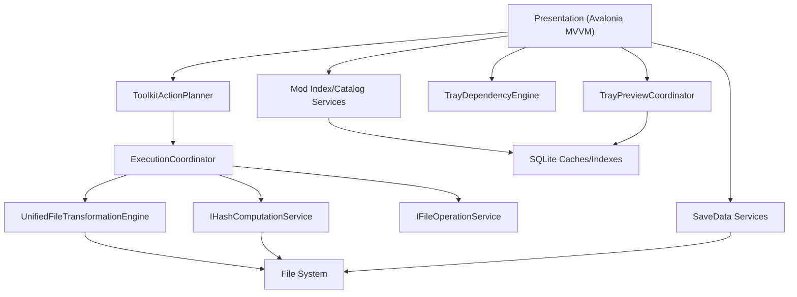

# SimsToolkit Technical Architecture

[](LICENSE)
[](https://dotnet.microsoft.com/)
[]()

[中文文档](README.zh-CN.md)

## 1. System Overview

SimsToolkit is a desktop toolkit for The Sims 4 mod/file workflows and game data inspection.  
After the refactor, the runtime path is centered on a pure .NET layered architecture:

* Presentation: Avalonia + MVVM view models/controllers
* Application: planning, validation, execution orchestration, use-case contracts
* Infrastructure: file/hash services, SQLite-backed stores, texture/tray/save adapters
* Feature engines: unified file transformation engine, tray dependency engine, package parsing core

---

## 2. Core Capabilities

### 2.1 File Transformation Pipeline
* Unified engine modes: `Organize`, `Flatten`, `Normalize`, `Merge`
* Shared conflict controls: name conflict verification, prefix hash, worker parallelism
* `FindDuplicates` runs in-app via hash grouping + optional cleanup/export CSV

### 2.2 Asset & Dependency Analysis
* Tray dependency analysis is handled by `SimsModDesktop.TrayDependencyEngine`
* Tray preview and metadata/thumbnail cache are handled by infrastructure tray services
* Save data read/export pipeline is handled by `SimsModDesktop.SaveData`

### 2.3 Mod Package & Texture Tooling
* DBPF package parsing and resource indexing: `SimsModDesktop.PackageCore`
* Mod catalog/index/inspect flow backed by SQLite stores
* Texture decode/resize/encode/compression pipeline via ImageSharp + BCn encoder adapters

---

## 3. Runtime Architecture



### 3.1 Planning and Validation
`ToolkitActionPlanner` translates UI state into typed execution plans:
* toolkit execution plan (`ISimsExecutionInput`)
* tray dependency analysis request
* tray preview input
* texture compression request

### 3.2 Execution Path
`ExecutionCoordinator` dispatches:
* `Flatten/Normalize/Merge/Organize` -> `UnifiedFileTransformationEngine`
* `FindDuplicates` -> in-process duplicate pipeline with hash service

### 3.3 Service Composition
Dependency injection is layered through:
* `AddSimsModDesktopApplication()`
* `AddSimsModDesktopPresentation()`
* `AddSimsModDesktopInfrastructure()`
* shell adapters in `src/SimsModDesktop/Composition/ServiceCollectionExtensions.cs`

---

## 4. Solution Layout

```text
/
├── src/SimsModDesktop/                        # Desktop host (Avalonia app shell)
├── src/SimsModDesktop.Application/            # App-layer contracts/planning/execution
├── src/SimsModDesktop.Presentation/           # ViewModels/controllers/navigation
├── src/SimsModDesktop.Infrastructure/         # Cross-platform services + persistence
├── src/SimsModDesktop.PackageCore/            # DBPF/package parsing core
├── src/SimsModDesktop.SaveData/               # Save/tray export readers and models
├── src/SimsModDesktop.TrayDependencyEngine/   # Tray dependency analysis + export
└── src/SimsModDesktop.Tests/                  # Architecture, behavior, and service tests
```

---

## 5. Current Engineering Notes

* The app architecture intentionally keeps application layer free from legacy routing types
* Architecture guard tests assert forbidden old artifacts are not reintroduced
* Multiple `NoOp*UseCase` registrations exist as migration seams for future use-case extraction
* Engineering conventions for layer boundaries and placement rules: `src/SimsModDesktop/docs/EngineeringConventions.md`
* Pull request review checklist for structural changes: `src/SimsModDesktop/docs/PullRequestChecklist.md`

---

## 6. Build and Test

```powershell
dotnet build SimsDesktopTools.sln
dotnet test SimsDesktopTools.sln
```
