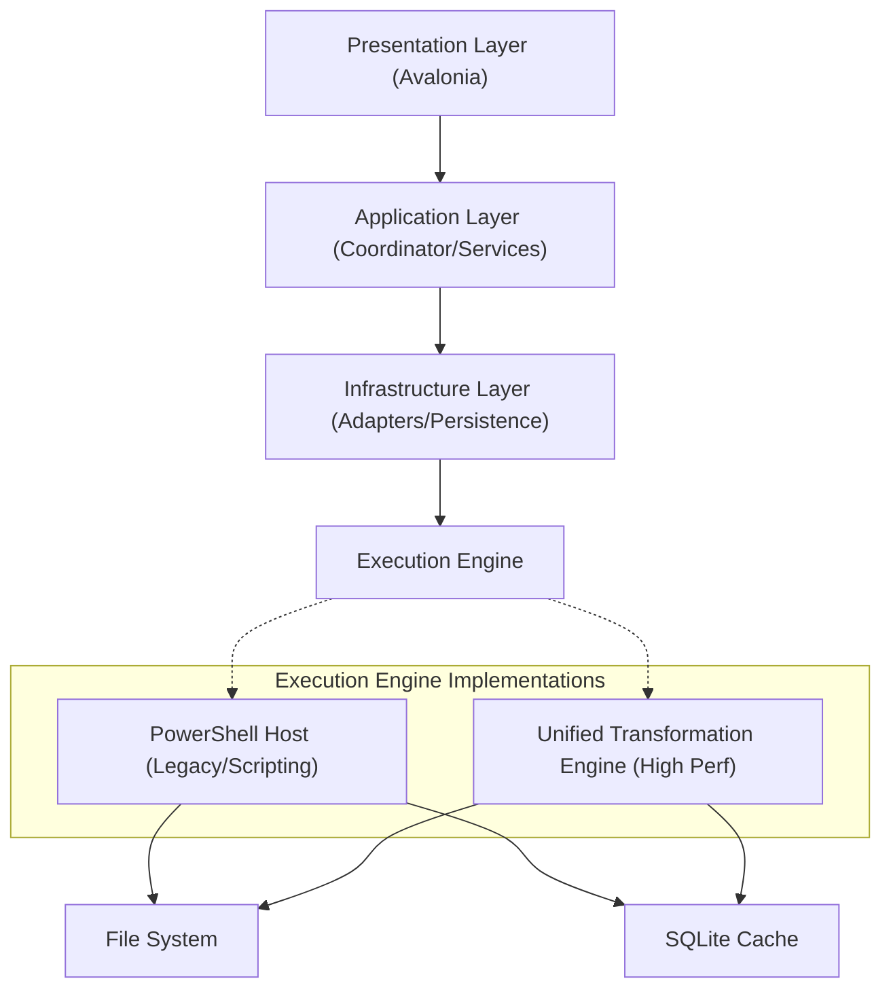
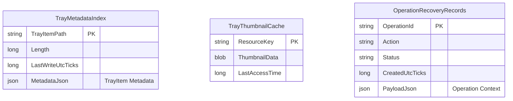
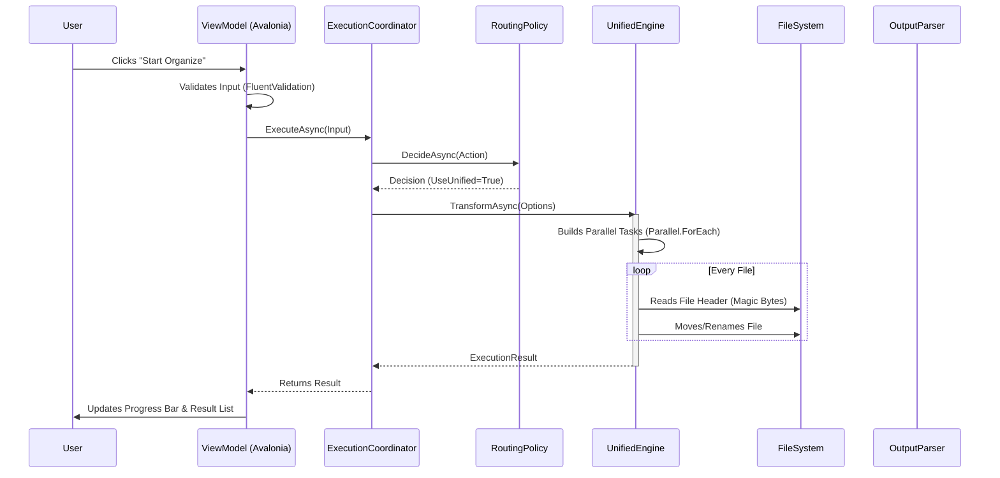

# SimsToolkit Technical Architecture

[](LICENSE)
[](https://dotnet.microsoft.com/)
[]()

[中文文档](README.zh-CN.md)

## 1. System Overview

SimsToolkit is a high-performance mod management and data analysis system designed specifically for *The Sims 4*. The project adopts a **Hybrid Architecture**, combining the strong type safety and high performance of **.NET 8 (C#)** with the flexible file system manipulation capabilities of **PowerShell Core**.

### Core Design Principles
*   **Separation of Concerns (SoC)**: Strict decoupling between the UI presentation layer, business orchestration layer, and the underlying execution engine.
*   **Plugin-based Architecture**: All functional modules (e.g., deduplication, compression, preview) are registered as independent Modules, adhering to a unified lifecycle interface.
*   **Progressive Migration**: The system supports dual-engine execution (PowerShell Legacy & .NET Native), allowing for the gradual migration of IO-intensive tasks from scripts to native compiled code to improve performance.
*   **Cross-Platform Compatibility**: Built on Avalonia UI and PowerShell Core, ensuring a consistent experience across Windows and macOS.

---

## 2. Core Features & Technical Implementation

### 2.1 Intelligent File Orchestration
A high-performance file operation subsystem based on `UnifiedFileTransformationEngine`, designed to handle tens of thousands of Mod files.
*   **Topology Flattening**: Recursively traverses deeply nested directories, extracting Mod files to the top level or heuristically organizing them. Supports `Parallel.ForEach` for parallel processing to maximize IO throughput.
*   **Content-Addressable Deduplication**:
    *   Uses a dual-hash verification algorithm (**XXHash/MD5**).
    *   First calculates a 4KB file header fingerprint for rapid filtering, computing the full hash only for potential duplicates, significantly reducing CPU usage.
*   **Heuristic Organization**: Automatically categorizes scattered CC (Custom Content) into standardized directories like `Clothes/`, `Hair/`, `Objects/` based on filename pattern matching (Regex) and metadata analysis.

### 2.2 Game Asset Deep Analysis
*   **Tray Dependency Injection**:
    *   Parses binary Protobuf formats like `.trayitem`, `.blueprint`, and `.bpi`.
    *   Builds an in-memory reference graph to automatically identify missing Mod dependencies (CC) for households and lots.
*   **Save Game Tracing**: Parses `.save` file headers and compression blocks to extract household overviews and game progress metadata, supporting rapid diagnosis of corrupted saves.

### 2.3 Graphics Engineering
*   **Texture Compression Pipeline**:
    *   Integrates **BCnEncoder.NET** and **ImageSharp** to transcode uncompressed textures into VRAM-friendly **BC7/BC3 (DXT5)** formats.
    *   Automatically generates Mipmap chains to optimize VRAM bandwidth usage and rendering performance during gameplay.
*   **High-Fidelity Preview**:
    *   Supports parsing `RLE2`/`LZO` compressed resources within `.package` (DBPF) containers.
    *   Real-time rendering of DXT/PNG textures, providing WYSIWYG Mod content review.

---

## 3. High-Level Architecture

The system adopts a layered architecture style, divided into four layers from top to bottom:



### 3.1 Presentation Layer
*   **Framework**: Avalonia UI (XAML + C#)
*   **Pattern**: MVVM (Model-View-ViewModel)
*   **Responsibilities**:
    *   View state management (`IModuleState`)
    *   User input validation (`FluentValidation`)
    *   Asynchronous task triggering and progress feedback rendering

### 3.2 Application Layer
*   **Core Component**: `ExecutionCoordinator`
*   **Responsibilities**:
    *   **Routing**: Decides whether a task is executed by PowerShell or the Native Engine based on `ExecutionEngineRoutingPolicy`.
    *   **Strategy Dispatch**: Uses the Strategy Pattern (`IActionExecutionStrategy`) to convert domain models (`ISimsExecutionInput`) into executable instructions.
    *   **Module Management**: `ActionModuleRegistry` is responsible for loading and managing all functional modules.

### 3.3 Infrastructure Layer
*   **Inter-Process Communication (IPC)**: `SimsPowerShellRunner` encapsulates external process management, implementing custom protocol parsing based on StdOut.
*   **Persistence**: A high-performance cache system based on SQLite, adopting WAL (Write-Ahead Logging) mode to improve concurrent write performance.
*   **Cross-Platform Abstraction**: Encapsulates `IFileOperationService` and `IHashComputationService` to abstract away operating system differences.

#### Data Persistence Schema


---

## 4. Core Flows Analysis

### 4.1 Execution Sequence
The following sequence diagram illustrates the end-to-end processing flow after a user initiates an "Organize" operation:



### 4.2 Hybrid Execution Engine & IPC Protocol
To achieve efficient communication between the C# host and PowerShell scripts, this project defines a lightweight IPC protocol.

1.  **Command Construction**: `SimsCliArgumentBuilder` serializes object parameters into a CLI argument list.
2.  **Process Startup**: `ProcessStartInfo` redirects Standard Output (StdOut) and Standard Error (StdErr).
3.  **Progress Reporting Protocol**:
    The script outputs progress information in a specific format, which the C# side `SimsPowerShellRunner` intercepts and parses in real-time:
    ```text
    ##SIMS_PROGRESS##|CurrentCount|TotalCount|Percent|DetailMessage
    ```
4.  **Result Return Mechanism (Out-of-Band Data Transfer)**:
    Since console output is unsuitable for transferring complex structured data, the system adopts an **Out-of-Band Transfer** mode. The script writes execution results to a temporary CSV/JSON file, and the C# side `ExecutionOutputParser` (e.g., `FindDupOutputParser`) reads and deserializes this file after the process ends, mapping it to the `ActionResultRow` model.

### 4.3 Unified File Transformation Engine
For high-performance scenarios (such as organizing tens of thousands of Mod files), the system includes a built-in `UnifiedFileTransformationEngine`.
*   **Design Pattern**: Strategy Pattern (`ITransformationModeHandler`)
*   **Concurrency Model**: Uses `Parallel.ForEachAsync` or `Dataflow` blocks to implement multi-threaded file processing.
*   **Supported Modes**: Flatten, Normalize, Merge, Organize.
*   **Advantages**: Compared to PowerShell scripts, it reduces process startup overhead and serialization costs, significantly improving File IO performance.

---

## 5. Technical Engineering

### 5.1 Performance Engineering
*   **WAL Mode (Write-Ahead Logging)**: All SQLite databases enable WAL mode with `PRAGMA synchronous = NORMAL`, drastically improving write throughput while ensuring data integrity.
*   **Parallel Processing**: `UnifiedFileTransformationEngine` uses `Parallel.ForEachAsync` to handle massive amounts of files, automatically adjusting concurrency based on CPU core count.
*   **Memory Optimization**: Utilizes `ArrayPool<T>` and `Span<T>` to optimize large file I/O, reducing GC pressure.

### 5.2 Resilience & Recovery
*   **Transactional Operations**: Critical file operations (like Move/Delete) are recorded in the `OperationRecoveryRecords` table, supporting atomic-level rollback.
*   **Graceful Degradation**: When the Native Engine encounters unknown exceptions or validation failures, the system can automatically downgrade to the PowerShell Engine for execution, ensuring business availability.

### 5.3 Cross-Cutting Concerns
*   **Structured Logging**: Integrates `Microsoft.Extensions.Logging`, supporting context correlation.
*   **Configuration Management**: Layered configuration system based on `IConfigurationProvider`, supporting environment variable overrides.

---

## 6. Directory Mapping

```text
/
├── modules/                      # PowerShell Core Business Scripts (Independent Testable Units)
│   ├── SimsConfig.ps1           # Global Configuration Definition
│   ├── SimsFileOpsCore.psm1     # Atomic File Operation Instructions
│   └── SimsModToolkit.psm1      # Business Logic Entry Point
├── src/SimsModDesktop/           # .NET Main Application
│   ├── Application/
│   │   ├── Execution/           # Core Execution Logic (Coordinator, Strategies)
│   │   ├── Modules/             # Module Definitions & Registry
│   │   └── Requests/            # Command Objects (CQRS Pattern)
│   ├── Infrastructure/
│   │   ├── Execution/           # PowerShell Host Implementation
│   │   └── Persistence/         # SQLite Database Implementation
│   ├── Services/                # Native Services (Image Processing, Hashing)
│   └── ViewModels/              # MVVM View Models
```

## 7. Developer Guide

### 7.1 Adding New Functional Modules
Following the **Open-Closed Principle (OCP)**, adding new features does not require modifying core engine code:
1.  **Define Input**: Create an input model inheriting from `ISimsExecutionInput` in `Application/Requests`.
2.  **Implement Strategy**: Implement `IActionExecutionStrategy<T>`, defining how to convert input into CLI arguments.
3.  **Register Module**: Register the new `IActionModule` in `ServiceCollectionExtensions`.
4.  **Implement UI**: Create the corresponding ViewModel and View, and mount them to the main interface.

### 7.2 Debugging & Testing
*   **Unit Tests**: `SimsModDesktop.Tests` contains tests for ViewModels and Services.
*   **Integration Tests**: It is recommended to use `scripts/smoke-actions.ps1` for end-to-end script smoke testing.
*   **Logging**: The system uses `Microsoft.Extensions.Logging`, outputting logs to the console, supporting detailed Debug level tracing.
