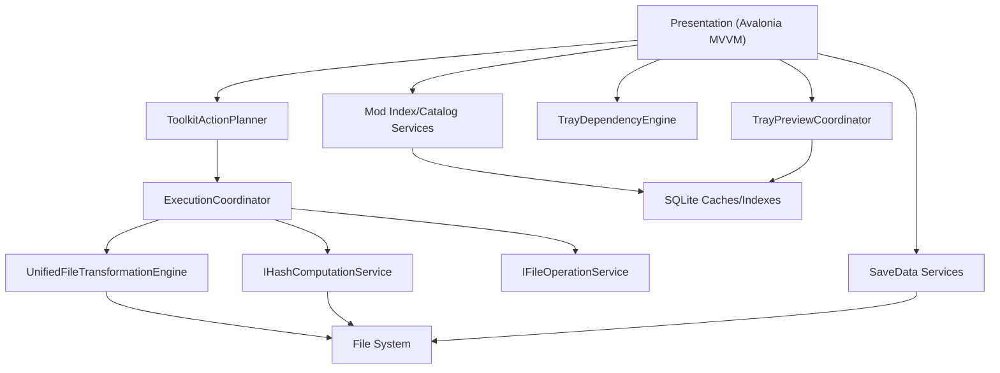

# SimsToolkit 技术架构文档

[](LICENSE)
[](https://dotnet.microsoft.com/)
[]()

[English](README.md)

## 1. 系统概览

SimsToolkit 是面向《模拟人生 4》的桌面工具集，覆盖 Mod 文件整理、依赖分析、预览与资源处理。  
当前运行时主路径为纯 .NET 分层架构：

* Presentation 层：Avalonia + MVVM（ViewModel/Controller）
* Application 层：规划、校验、执行协调、用例契约
* Infrastructure 层：跨平台文件/哈希服务、SQLite 持久化、托盘/贴图/存档适配
* 功能引擎层：统一文件转换引擎、Tray 依赖分析引擎、Package 解析核心

---

## 2. 核心能力

### 2.1 文件转换流水线
* 统一引擎支持 `Organize`、`Flatten`、`Normalize`、`Merge`
* 共享冲突策略：同名内容校验、前缀哈希、并行 worker 配置
* `FindDuplicates` 在应用内执行，支持重复组导出和清理

### 2.2 资产与依赖分析
* Tray 依赖分析由 `SimsModDesktop.TrayDependencyEngine` 提供
* Tray 预览与缩略图/元数据缓存由基础设施层托盘服务提供
* 存档读取与导出能力由 `SimsModDesktop.SaveData` 提供

### 2.3 Package 与纹理工具链
* DBPF 解析与资源索引：`SimsModDesktop.PackageCore`
* Mod 索引/目录/详情查看由 SQLite 存储支撑
* 纹理解码、缩放、编码、压缩通过 ImageSharp + BCn 编码适配器实现

---

## 3. 运行时架构



### 3.1 规划与校验
`ToolkitActionPlanner` 负责将 UI 状态转换为强类型计划：
* 工具执行计划（`ISimsExecutionInput`）
* Tray 依赖分析请求
* Tray 预览输入
* 纹理压缩请求

### 3.2 执行路径
`ExecutionCoordinator` 当前分发逻辑：
* `Flatten/Normalize/Merge/Organize` -> `UnifiedFileTransformationEngine`
* `FindDuplicates` -> 进程内重复文件扫描与哈希分组

### 3.3 服务装配
依赖注入按层注册：
* `AddSimsModDesktopApplication()`
* `AddSimsModDesktopPresentation()`
* `AddSimsModDesktopInfrastructure()`
* 桌面壳适配在 `src/SimsModDesktop/Composition/ServiceCollectionExtensions.cs`

---

## 4. 目录映射

```text
/
├── src/SimsModDesktop/                        # 桌面宿主（Avalonia）
├── src/SimsModDesktop.Application/            # 应用层：规划/执行/契约
├── src/SimsModDesktop.Presentation/           # 展示层：VM/控制器/导航
├── src/SimsModDesktop.Infrastructure/         # 基础设施：服务/持久化/适配
├── src/SimsModDesktop.PackageCore/            # DBPF 解析核心
├── src/SimsModDesktop.SaveData/               # 存档读取与导出
├── src/SimsModDesktop.TrayDependencyEngine/   # Tray 依赖分析与导出
└── src/SimsModDesktop.Tests/                  # 架构与行为测试
```

---

## 5. 当前工程说明

* Application 层已明确隔离旧式路由与脚本耦合类型
* 架构守卫测试会阻止旧组件被重新引入
* 多个 `NoOp*UseCase` 当前作为后续用例层收敛的迁移缝隙

---

## 6. 构建与测试

```powershell
dotnet build SimsDesktopTools.sln
dotnet test SimsDesktopTools.sln
```
