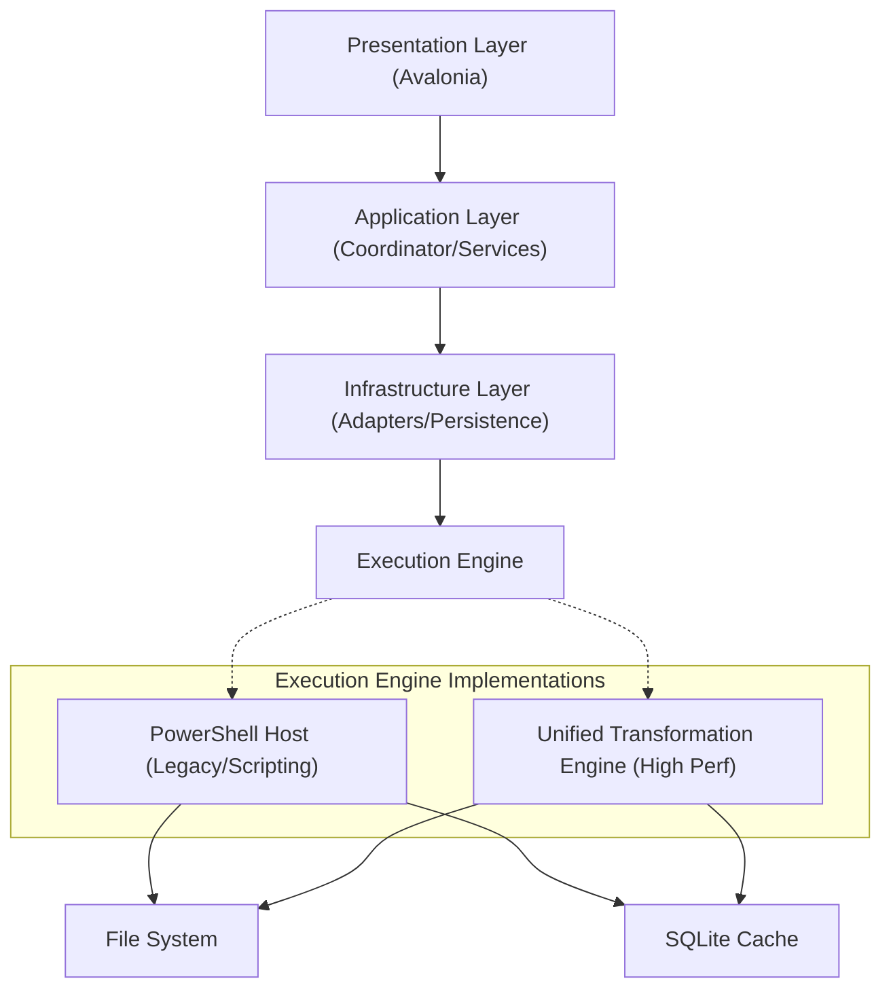
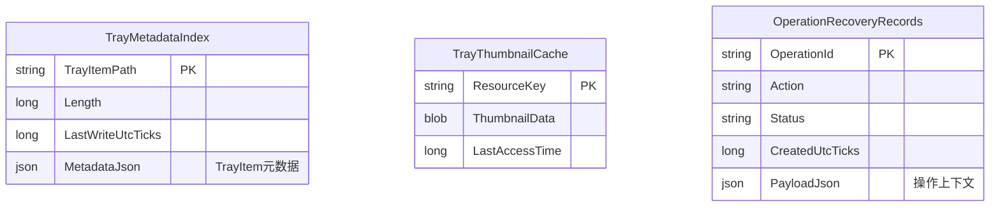
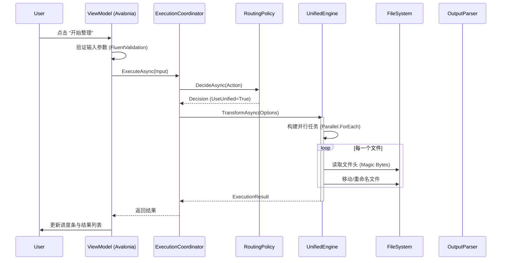

# SimsToolkit 技术架构文档

## 1. 系统概览 (System Overview)

SimsToolkit 是一个专为《模拟人生4》(The Sims 4) 设计的高性能模组管理与数据分析系统。项目采用 **混合架构 (Hybrid Architecture)**，结合了 .NET 8 (C#) 的强类型安全与高性能特性，以及 PowerShell Core 的灵活文件系统操作能力。

### 核心设计原则
*   **关注点分离 (SoC)**: UI 表现层、业务调度层与底层执行引擎严格解耦。
*   **插件化架构 (Plugin-based)**: 所有功能模块（如去重、压缩、预览）均作为独立 Module 注册，遵循统一的生命周期接口。
*   **渐进式迁移 (Progressive Migration)**: 系统支持双引擎运行（PowerShell Legacy & .NET Native），允许逐步将 IO 密集型任务从脚本迁移至本地编译代码以提升性能。
*   **跨平台兼容 (Cross-Platform)**: 基于 Avalonia UI 与 PowerShell Core，确保在 Windows/macOS 上的体验一致性。

---

## 2. 核心功能与技术实现 (Core Features & Technical Implementation)

### 2.1 智能文件编排 (Intelligent File Orchestration)
基于 `UnifiedFileTransformationEngine` 的高性能文件操作子系统，专为处理数万级 Mod 文件设计。
*   **拓扑扁平化 (Topology Flattening)**: 递归遍历深层嵌套目录，将 Mod 文件提取至顶层或智能归档，支持 `Parallel.ForEach` 并行处理以最大化 IO 吞吐。
*   **内容寻址去重 (Content-Addressable Deduplication)**: 
    *   采用 **XXHash/MD5** 双重哈希校验算法。
    *   首先计算 4KB 文件头指纹进行快速筛选，仅对潜在重复项计算全量哈希，显著降低 CPU 占用。
*   **智能归档 (Heuristic Organization)**: 基于文件名模式匹配 (Regex) 与元数据分析，自动将散乱的 CC (Custom Content) 归类至 `Clothes/`, `Hair/`, `Objects/` 等标准化目录。

### 2.2 游戏资产深度分析 (Game Asset Deep Analysis)
*   **Tray 依赖注入分析 (Tray Dependency Injection)**: 
    *   解析 `.trayitem`, `.blueprint`, `.bpi` 等二进制 Protobuf 格式文件。
    *   构建内存中的依赖引用图 (Reference Graph)，自动识别房屋/人物存档中缺失的 Mod 依赖 (CC)。
*   **存档溯源 (Save Game Tracing)**: 解析 `.save` 文件头与压缩块，提取家庭概况与游戏进度元数据，支持损坏存档的快速诊断。

### 2.3 图形资源工程 (Graphics Engineering)
*   **纹理压缩流水线 (Texture Compression Pipeline)**:
    *   集成 **BCnEncoder.NET** 与 **ImageSharp**，支持将未压缩的贴图转码为显存友好的 **BC7/BC3 (DXT5)** 格式。
    *   自动生成 Mipmaps 链，优化游戏运行时的显存带宽占用与渲染性能。
*   **高保真预览 (High-Fidelity Preview)**:
    *   支持解析 `.package` (DBPF) 容器内的 `RLE2`/`LZO` 压缩资源。
    *   实时渲染 DXT/PNG 纹理，提供所见即所得的 Mod 内容审查。

---

## 3. 总体架构设计 (High-Level Architecture)

系统整体采用分层架构风格，自上而下分为四层：



### 3.1 表现层 (Presentation Layer)
*   **框架**: Avalonia UI (XAML + C#)
*   **模式**: MVVM (Model-View-ViewModel)
*   **职责**: 
    *   视图状态管理 (`IModuleState`)
    *   用户输入验证 (`FluentValidation`)
    *   异步任务触发与进度反馈渲染

### 3.2 应用层 (Application Layer)
*   **核心组件**: `ExecutionCoordinator`
*   **职责**: 
    *   **任务路由 (Routing)**: 根据 `ExecutionEngineRoutingPolicy` 决定任务由 PowerShell 还是 Native Engine 执行。
    *   **策略分发 (Strategy Dispatch)**: 使用策略模式 (`IActionExecutionStrategy`) 将领域模型 (`ISimsExecutionInput`) 转换为可执行指令。
    *   **模块管理**: `ActionModuleRegistry` 负责加载和管理所有功能模块。

### 3.3 基础设施层 (Infrastructure Layer)
*   **进程间通信 (IPC)**: `SimsPowerShellRunner` 封装了对外部进程的管理，实现了基于 StdOut 的自定义协议解析。
*   **持久化 (Persistence)**: 基于 SQLite 的高性能缓存系统，采用 WAL (Write-Ahead Logging) 模式以提升并发写入性能。
*   **跨平台抽象**: 封装了 `IFileOperationService` 和 `IHashComputationService` 以屏蔽操作系统差异。

#### 数据持久化模型 (Data Schema)


---

## 4. 关键链路分析 (Core Flows Analysis)

### 4.1 任务执行时序 (Execution Sequence)
以下时序图展示了用户发起 "Organize" 操作后的端到端处理流程：



### 4.2 混合执行引擎与 IPC 协议
为了在 C# 宿主与 PowerShell 脚本间实现高效通信，本项目定义了一套轻量级 IPC 协议。

1.  **命令构建**: `SimsCliArgumentBuilder` 将对象参数序列化为 CLI 参数列表。
2.  **进程启动**: `ProcessStartInfo` 重定向标准输出 (StdOut) 与错误流 (StdErr)。
3.  **进度回传协议**: 
    脚本端通过特定格式输出进度信息，C# 端 `SimsPowerShellRunner` 实时拦截并解析：
    ```text
    ##SIMS_PROGRESS##|CurrentCount|TotalCount|Percent|DetailMessage
    ```
4.  **结果回传机制 (Out-of-Band Data Transfer)**:
    由于控制台输出不适合传输复杂结构化数据，系统采用**带外传输**模式。脚本将执行结果写入临时 CSV/JSON 文件，C# 端的 `ExecutionOutputParser` (如 `FindDupOutputParser`) 在进程结束后读取并反序列化该文件，映射为 `ActionResultRow` 模型。

### 3.2 统一文件转换引擎 (Unified File Transformation Engine)
针对高性能场景（如数万个 Mod 文件的整理），系统内置了 `UnifiedFileTransformationEngine`。
*   **设计模式**: 策略模式 (`ITransformationModeHandler`)
*   **并发模型**: 使用 `Parallel.ForEachAsync` 或 `Dataflow` 块实现多线程文件处理。
*   **支持模式**: Flatten, Normalize, Merge, Organize。
*   **优势**: 相比 PowerShell 脚本，减少了进程启动开销与序列化成本，文件 IO 性能提升显著。

---

## 5. 核心技术特性 (Technical Engineering)

### 5.1 性能工程 (Performance Engineering)
*   **WAL 模式 (Write-Ahead Logging)**: 所有 SQLite 数据库均启用 WAL 模式与 `PRAGMA synchronous = NORMAL`，在保证数据完整性的前提下大幅提升写入吞吐量。
*   **并行文件处理 (Parallel Processing)**: `UnifiedFileTransformationEngine` 使用 `Parallel.ForEachAsync` 处理海量文件，自动根据 CPU 核心数调整并发度。
*   **内存优化**: 采用 `ArrayPool<T>` 和 `Span<T>` 优化大文件读写，减少 GC 压力。

### 5.2 弹性与恢复 (Resilience & Recovery)
*   **事务性操作**: 关键文件操作（如 Move/Delete）被记录在 `OperationRecoveryRecords` 表中，支持原子级回滚。
*   **优雅降级 (Graceful Degradation)**: 当 Native Engine 遇到未知异常或校验失败时，系统可自动降级至 PowerShell Engine 执行，确保业务可用性。

### 5.3 横切关注点 (Cross-Cutting Concerns)
*   **结构化日志 (Structured Logging)**: 集成 Microsoft.Extensions.Logging，支持上下文关联。
*   **配置管理**: 基于 `IConfigurationProvider` 的分层配置系统，支持环境变量覆盖。

---

## 6. 目录结构与模块映射 (Directory Mapping)

```text
/
├── modules/                      # PowerShell 核心业务脚本 (独立可测试单元)
│   ├── SimsConfig.ps1           # 全局配置定义
│   ├── SimsFileOpsCore.psm1     # 文件操作原子指令集
│   └── SimsModToolkit.psm1      # 业务逻辑入口
├── src/SimsModDesktop/           # .NET 主程序
│   ├── Application/
│   │   ├── Execution/           # 核心执行逻辑 (Coordinator, Strategies)
│   │   ├── Modules/             # 模块定义与注册表
│   │   └── Requests/            # 命令对象 (CQRS Pattern)
│   ├── Infrastructure/
│   │   ├── Execution/           # PowerShell 宿主实现
│   │   └── Persistence/         # SQLite 数据库实现
│   ├── Services/                # 本地服务 (Image Processing, Hashing)
│   └── ViewModels/              # MVVM 视图模型
```

## 7. 开发指南 (Developer Guide)
 
### 7.1 新增功能模块
遵循 **开闭原则 (OCP)**，新增功能无需修改核心引擎代码：
1.  **定义输入**: 在 `Application/Requests` 创建继承自 `ISimsExecutionInput` 的输入模型。
2.  **实现策略**: 实现 `IActionExecutionStrategy<T>`，定义如何将输入转换为 CLI 参数。
3.  **注册模块**: 在 `ServiceCollectionExtensions` 中注册新的 `IActionModule`。
4.  **实现 UI**: 创建对应的 ViewModel 和 View，并挂载到主界面。

### 7.2 调试与测试
*   **单元测试**: `SimsModDesktop.Tests` 包含对 ViewModel 和 Service 的测试。
*   **集成测试**: 推荐使用 `scripts/smoke-actions.ps1` 进行端到端的脚本冒烟测试。
*   **日志**: 系统使用 `Microsoft.Extensions.Logging`，日志输出至控制台，支持详细的 Debug 级别追踪。
