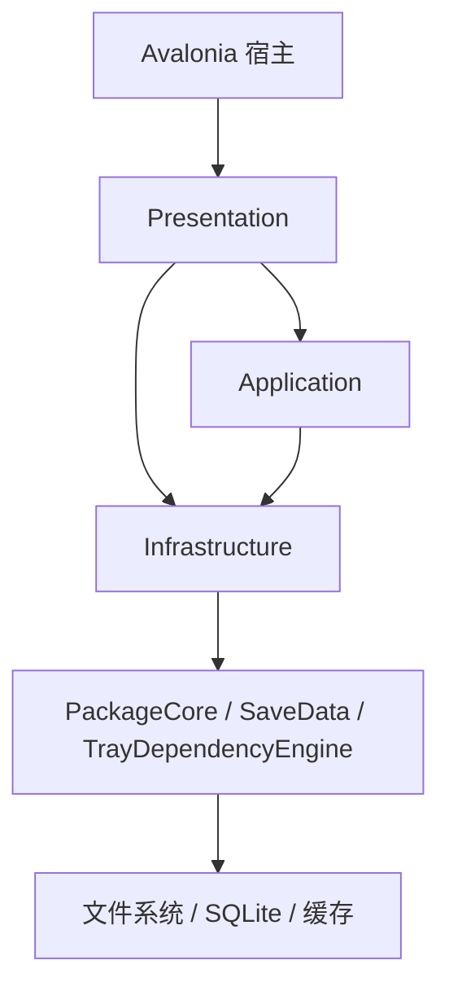

# SimsToolkit 技术架构文档

[](LICENSE)
[](https://dotnet.microsoft.com/)
[]()

[English](README.md)

## 1. 系统概览

SimsToolkit 是面向《模拟人生 4》的桌面工具集，覆盖 Mod 文件整理、依赖分析、预览、资源处理与存档相关工作流。

当前代码库按分层 .NET 架构组织：

* `SimsModDesktop`：Avalonia 宿主、窗口壳和组合根
* `SimsModDesktop.Presentation`：ViewModel、UI 控制器、导航、预热编排
* `SimsModDesktop.Application`：用例契约、规划器、校验器、执行协调
* `SimsModDesktop.Infrastructure`：持久化、文件/哈希/配置服务、tray/save 适配
* `SimsModDesktop.PackageCore`：DBPF/Package 解析基础能力
* `SimsModDesktop.SaveData`：存档读取、外观关联、household 导出支撑
* `SimsModDesktop.TrayDependencyEngine`：Tray 依赖分析与导出

推荐先读：

* [`src/SimsModDesktop/docs/ArchitectureOverview.md`](src/SimsModDesktop/docs/ArchitectureOverview.md)
* [`src/SimsModDesktop/docs/EngineeringConventions.md`](src/SimsModDesktop/docs/EngineeringConventions.md)
* [`src/SimsModDesktop/docs/CacheWarmupSequence.md`](src/SimsModDesktop/docs/CacheWarmupSequence.md)

---

## 2. 核心能力

### 2.1 Toolkit 动作

* `Organize`
* `Flatten`
* `Normalize`
* `Merge`
* `FindDuplicates`

这些流程统一经由 `ToolkitActionPlanner` 规划，再由 `ExecutionCoordinator` 分发。

### 2.2 Mods / Tray / Save 工作区

* Mods：索引目录、详情查看、查询缓存、空闲预热
* Tray：预览、缩略图/元数据缓存、依赖分析与导出
* Save：descriptor-first 预览、按需 artifact 生成、household 导出

### 2.3 资源处理

* DBPF 资源解析与索引
* 纹理解码、缩放、编码、压缩
* Tray bundle 解析复用和 package-index 驱动的依赖分析

---

## 3. 运行时架构



### 3.1 运行时入口

* `Program.cs` 启动 Avalonia
* `Composition/ServiceCollectionExtensions.cs` 负责组合容器
* `MainShellViewModel` 管理壳层导航与启动期预热
* `MainWindowViewModel` 与各 Workspace ViewModel 管理页面状态

### 3.2 依赖注入注册

注册按层拆分：

* `AddSimsModDesktopApplication()`
* `AddSimsModDesktopPresentation()`
* `AddSimsModDesktopInfrastructure()`
* 桌面壳适配位于 `src/SimsModDesktop/Composition/ServiceCollectionExtensions.cs`

---

## 4. 目录映射

```text
/
├── src/SimsModDesktop/                        # 桌面宿主（Avalonia）
├── src/SimsModDesktop.Application/            # 应用层：规划/执行/契约
├── src/SimsModDesktop.Presentation/           # 展示层：VM/控制器/导航
├── src/SimsModDesktop.Infrastructure/         # 基础设施：服务/持久化/适配
├── src/SimsModDesktop.PackageCore/            # DBPF 解析核心
├── src/SimsModDesktop.SaveData/               # 存档读取与导出
├── src/SimsModDesktop.TrayDependencyEngine/   # Tray 依赖分析与导出
├── src/SimsModDesktop.Tests/                  # 应用/展示/基础设施测试
├── src/SimsModDesktop.PackageCore.Tests/      # PackageCore 测试
└── src/SimsModDesktop.TrayDependencyEngine.Tests/ # 依赖引擎测试
```

---

## 5. 当前工程说明

* Application 层保持 UI 无关。
* Tray dependency cache 与 UI preview cache 继续分离。
* `Mods`、`Tray`、`Save` 已共用后台预热底座，但各自的数据存储仍按域拆分。
* `Save` 预览已经切到 descriptor-first，依赖分析走按需 artifact。

常用文档：

* [ArchitectureOverview.md](src/SimsModDesktop/docs/ArchitectureOverview.md)
* [ModularizationPlan.md](src/SimsModDesktop/docs/ModularizationPlan.md)
* [CacheWarmupSequence.md](src/SimsModDesktop/docs/CacheWarmupSequence.md)
* [PerformanceOptimizationPlan.md](src/SimsModDesktop/docs/PerformanceOptimizationPlan.md)
* [PerformanceOptimizationChecklist.md](src/SimsModDesktop/docs/PerformanceOptimizationChecklist.md)
* [EngineeringConventions.md](src/SimsModDesktop/docs/EngineeringConventions.md)
* [PullRequestChecklist.md](src/SimsModDesktop/docs/PullRequestChecklist.md)

---

## 6. 构建与测试

```powershell
dotnet build SimsDesktopTools.sln
dotnet test SimsDesktopTools.sln -m:1
```
