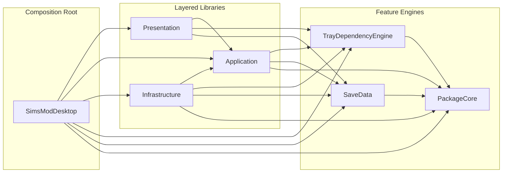
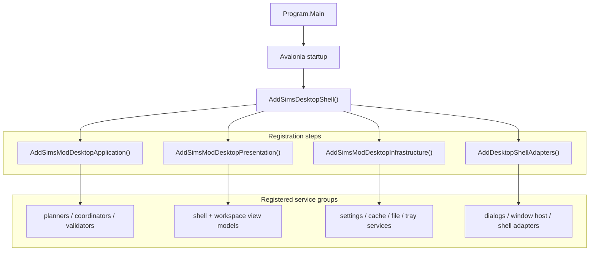
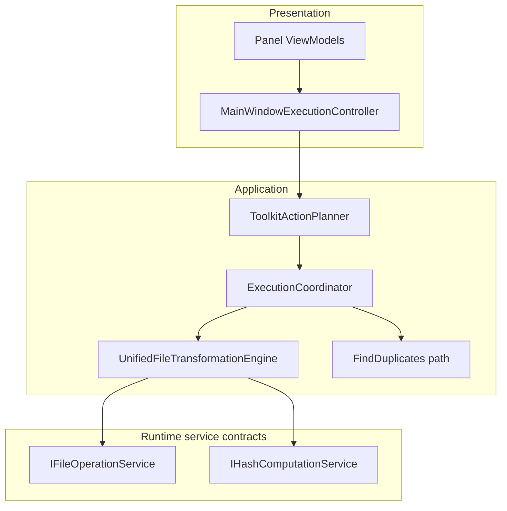

# SimsToolkit Architecture Overview

## 1. Solution Map

The solution is split into a desktop host plus layered libraries:

```text
src/
├── SimsModDesktop/                     # Avalonia host, shell composition, views
├── SimsModDesktop.Application/         # Use-case contracts, planners, coordinators, validators
├── SimsModDesktop.Presentation/        # View models, UI controllers, navigation, warmup orchestration
├── SimsModDesktop.Infrastructure/      # SQLite stores, file/hash/config services, tray/save adapters
├── SimsModDesktop.PackageCore/         # DBPF/package parsing and path identity primitives
├── SimsModDesktop.SaveData/            # Save readers, appearance linking, household export support
├── SimsModDesktop.TrayDependencyEngine/# Tray dependency analysis, export, package index cache
├── SimsModDesktop.Tests/               # App/integration-style tests
├── SimsModDesktop.PackageCore.Tests/   # PackageCore unit tests
└── SimsModDesktop.TrayDependencyEngine.Tests/ # Tray dependency engine tests
```

## 2. Layer Responsibilities

### 2.1 Host

`SimsModDesktop` contains the Avalonia application entry point, shell composition, and visual tree.

- `Program.cs` boots Avalonia.
- `Composition/ServiceCollectionExtensions.cs` is the root composition point.
- `Views/` contains Avalonia XAML.
- This is the only assembly that references `Presentation`, `Application`, and `Infrastructure` together.

### 2.2 Application

`SimsModDesktop.Application` defines the stable use-case layer.

- Input contracts and validators
- `ToolkitActionPlanner`
- `ExecutionCoordinator`
- module-level service interfaces such as:
  - `IPreviewQueryService`
  - `IModItemCatalogService`
  - `ISaveHouseholdCoordinator`
  - `IModsWarmupService`
  - `ITrayWarmupService`
  - `ISaveWarmupService`

This layer may depend on feature engines such as `PackageCore`, `SaveData`, and `TrayDependencyEngine`, but it should not know about Avalonia, SQLite-backed infrastructure implementations, or shell-specific concerns.

### 2.3 Presentation

`SimsModDesktop.Presentation` hosts screen/view-model behavior and UI orchestration.

- workspace view models for Toolkit, Mods, Tray, Save
- shell view models and navigation state
- controllers for execution, validation, recovery, tray preview, and export
- warmup services for mods, tray, save, and startup prewarm
- background prewarm scheduling and UI activity tracking

This layer owns page behavior and state, but delegates real work through `Application` contracts and feature-engine interfaces. The `Presentation` assembly does not reference `Infrastructure`; concrete infrastructure implementations are composed by the desktop host at runtime.

### 2.4 Infrastructure

`SimsModDesktop.Infrastructure` implements the interfaces declared in Application.

- configuration, settings, and app theme services
- file operations and hashing
- mod catalog/index persistence
- tray preview metadata/thumbnail/root snapshot stores
- save preview descriptor/artifact stores and builders
- app cache maintenance

This layer references `Application` plus the feature engines and provides concrete implementations for the service interfaces consumed by the host and presentation flows.

### 2.5 Feature Engines

- `SimsModDesktop.PackageCore`: DBPF/package parsing and path identity
- `SimsModDesktop.SaveData`: save reading, household export, appearance linking
- `SimsModDesktop.TrayDependencyEngine`: tray dependency analysis/export and package index cache

These projects encapsulate feature-heavy domains that are reused by Infrastructure and shell flows.

## 3. Composition and Startup

Compile-time dependency graph:



The host wires services in four steps:

1. `AddSimsModDesktopApplication()`
2. `AddSimsModDesktopPresentation()`
3. `AddSimsModDesktopInfrastructure()`
4. `AddDesktopShellAdapters()`



Architecture guard tests enforce that `Application` and `Presentation` do not take a direct assembly dependency on `Infrastructure`.

## 4. Main Runtime Flows

### 4.1 Toolkit Execution



Used for `Organize`, `Flatten`, `Normalize`, `Merge`, and `FindDuplicates`.

### 4.2 Mods Flow

- `ModPreviewWorkspaceViewModel` drives search/filter/page state.
- `SqliteModItemCatalogService` and related stores provide indexed mod data.
- `IListQueryCache` is the shared in-memory list query cache.
- idle prewarm can prime startup/default queries and next-page queries.

### 4.3 Tray Flow

- `TrayPreviewWorkspaceViewModel` drives page activation and export-ready behavior.
- `ITrayWarmupService` is the tray-facing warmup boundary consumed by the workspace.
- `IPreviewQueryService` is the preview-facing paging boundary consumed by preview surfaces.
- `PreviewQueryService` is the infrastructure implementation for tray/save projection and delegates tray-root source reading, projection/filtering, page materialization, metadata coordination, and save-descriptor source loading to dedicated helpers.
- `TrayPreviewRootSnapshotStore`, `TrayMetadataIndexStore`, and `TrayThumbnailCacheStore` back preview caching.
- `TrayDependencyEngine` handles dependency analysis and package export.

### 4.4 Save Flow

- `SaveWorkspaceViewModel` uses `SavePreviewDescriptor` as the preview source.
- `SaveHouseholdCoordinator` mediates load, descriptor build, artifact ensure, and export.
- `SavePreviewDescriptorBuilder/Store` provide descriptor-first preview state.
- `SavePreviewArtifactProvider/Store` provide on-demand per-household tray artifacts for dependency analysis.

## 5. Cache and Warmup Topology

There are now two major cache domains:

### 5.1 UI/App Cache

Backed mainly by `%AppData%/SimsModDesktop/Cache/app-cache.db` and artifact folders.

- mod list query cache
- tray root snapshot persistence
- tray metadata index
- tray thumbnail manifest/files
- save preview descriptor store
- save preview artifact manifest/files

### 5.2 Tray Dependency Cache

Backed separately by `%AppData%/SimsModDesktop/Cache/TrayDependencyPackageIndex/cache.db`.

- package index snapshot used by tray dependency analysis/export
- kept independent from UI preview cache on purpose

### 5.3 Warmup / Prewarm

Warmup is now consumed through domain-facing interfaces:

- `IModsWarmupService`
- `ITrayWarmupService`
- `ISaveWarmupService`
- `IStartupPrewarmService`

`MainWindowCacheWarmupController` is now an internal runtime/helper shell for shared inventory refresh, path normalization, file watchers, gates, and warmup session plumbing. Page and shell callers only depend on the domain-facing warmup services.

- `ModsWarmupService`
- `TrayWarmupService`
- `SaveWarmupService`

- Mods catalog readiness
- Tray dependency readiness
- Save preview descriptor readiness
- Save preview artifact readiness

`IStartupPrewarmService` schedules low-priority startup idle work through those domain-facing warmup interfaces for:

- tray dependency prewarm
- mods query prime
- save descriptor prewarm
- save artifact prewarm

## 6. Current Architectural Seams

The most important extension seams are:

- `IPreviewQueryService` for preview-facing paging behavior
- `IPreviewSourceReader`, `IPreviewProjectionEngine`, `IPreviewPageBuilder`, and `IPreviewMetadataFacade` for preview source loading, filtering, projection, and metadata coordination
- `TrayRootPreviewSourceReader`, `PreviewProjectionEngine`, `PreviewPageBuilder`, `PreviewMetadataFacade`, `TrayPreviewSnapshotPersistence`, and `SaveDescriptorPreviewSourceReader` as the internal seams behind `PreviewQueryService`
- `IListQueryCache` for future list-based query acceleration
- `IModsWarmupService` / `ITrayWarmupService` / `ISaveWarmupService` for domain warmup boundaries
- `IBackgroundCachePrewarmCoordinator` for additional idle/background jobs
- `ISavePreviewDescriptorStore` and `ISavePreviewArtifactProvider` for future save acceleration work
- `ITrayBundleAnalysisCache` for repeated tray dependency analysis/export reuse

## 7. Testing Strategy

The repository uses three main test scopes:

- `SimsModDesktop.PackageCore.Tests`: low-level parsing/path identity behavior
- `SimsModDesktop.TrayDependencyEngine.Tests`: dependency engine behavior and cache reuse
- `SimsModDesktop.Tests`: application/presentation/infrastructure behavior and wiring
- `ArchitectureProjectsTests`, `ArchitectureBoundaryTests`, and `PureArchitectureConstraintsTests` guard the compile-time layer boundaries and prevent legacy execution types from returning

Recommended validation command:

```powershell
dotnet test SimsDesktopTools.sln -m:1
```

`-m:1` avoids intermittent file-lock contention from parallel test hosts on Windows.
