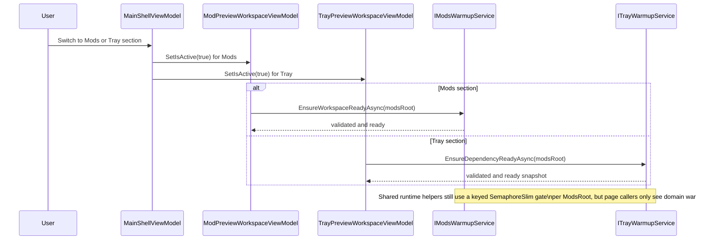
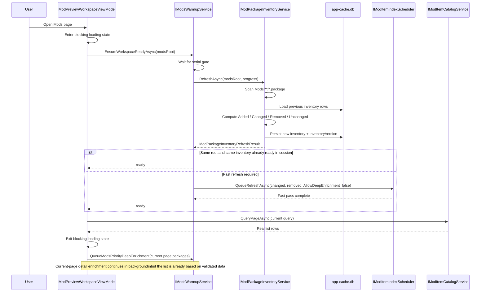
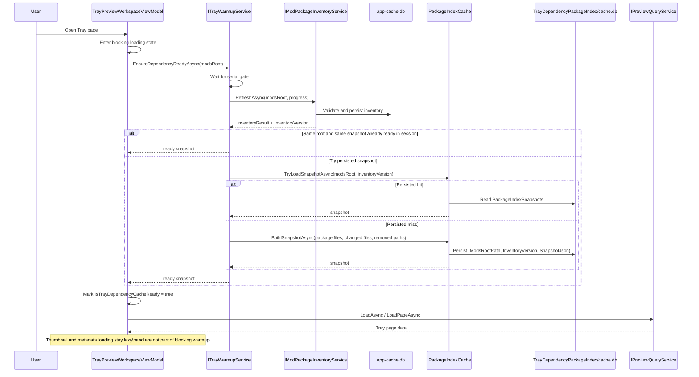
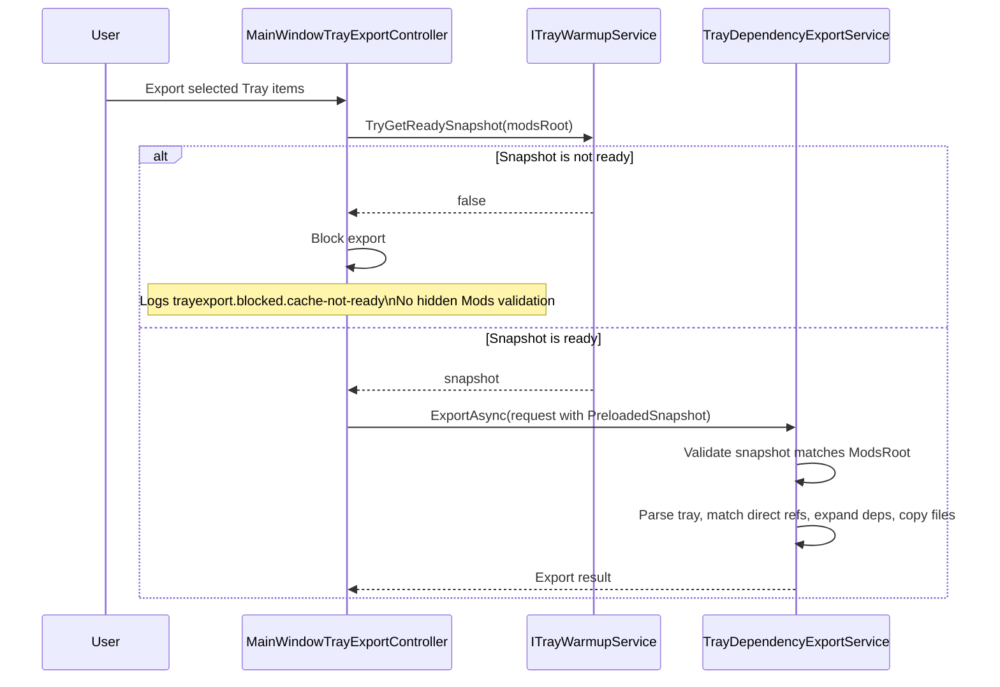
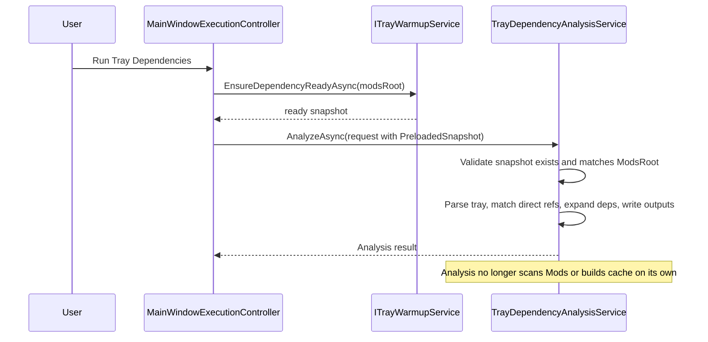
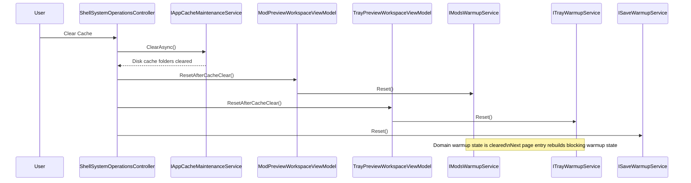

# Cache Warmup Sequence

This document captures the current page-level cache warmup flow after the cache refactor.

Current baseline:

* `Mods` and `Tray` still use page-triggered blocking warmup.
* startup idle prewarm is scheduled through `IStartupPrewarmService`, which delegates to domain warmup services.
* shared inventory/runtime helpers still use a keyed per-root gate to serialize work per `ModsRoot`.
* Tray export and Tray dependency analysis both consume a preloaded ready snapshot.
* `TrayDependencyEngine` no longer performs hidden `Mods` directory validation for export or analysis.

Relevant implementation anchors:

* `src/SimsModDesktop.Presentation/Warmup/ModsWarmupService.cs`
* `src/SimsModDesktop.Presentation/Warmup/TrayWarmupService.cs`
* `src/SimsModDesktop.Presentation/Warmup/SaveWarmupService.cs`
* `src/SimsModDesktop.Presentation/Services/StartupPrewarmService.cs`
* `src/SimsModDesktop.Presentation/ViewModels/MainWindowCacheWarmupController.cs`
* `src/SimsModDesktop.Presentation/ViewModels/Preview/ModPreviewWorkspaceViewModel.cs`
* `src/SimsModDesktop.Presentation/ViewModels/Preview/TrayPreviewWorkspaceViewModel.cs`
* `src/SimsModDesktop.Infrastructure/Mods/SqliteModPackageInventoryService.cs`
* `src/SimsModDesktop.TrayDependencyEngine/TrayDependencyExportService.cs`
* `src/SimsModDesktop.TrayDependencyEngine/TrayDependencyAnalysisService.cs`

---

## 1. System Overview

---

## 2. Mods Page First Load

---

## 3. Tray Page First Load

---

## 4. Tray Export

---

## 5. Tray Dependency Analysis

---

## 6. Cache Clear

---

## 7. Key Invariants

* startup idle warmup is scheduled through `IStartupPrewarmService`, but build/ensure work still lives in domain warmup services.
* `Mods` and `Tray` blocking warmup both reuse the same internal inventory/runtime helpers while exposing separate service boundaries.
* `SqliteModPackageInventoryService` is the package inventory source used by page warmup.
* Tray dependency snapshots are keyed by `(ModsRootPath, InventoryVersion)`.
* Export and analysis require `PreloadedSnapshot` and fail fast if cache is not ready.
* `TrayPreview` thumbnails and metadata remain lazy-loaded and are not promoted to a blocking page warmup stage.
